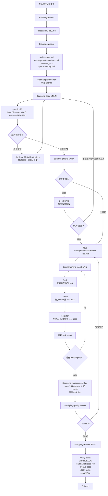
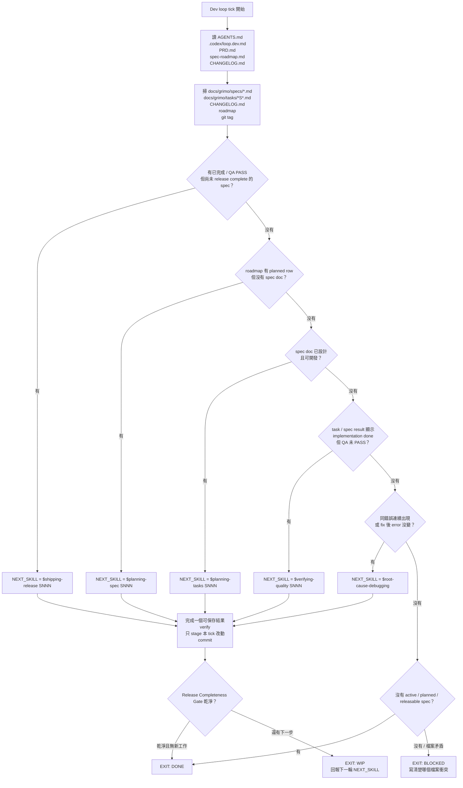
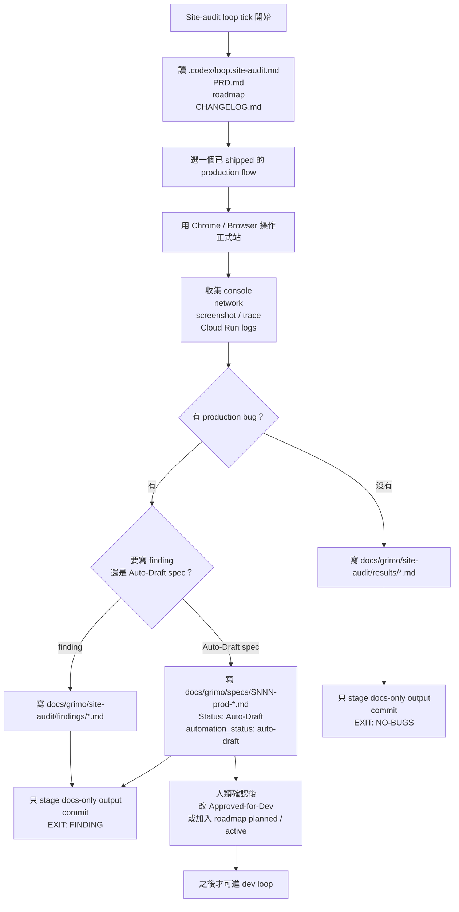

# Skills Hub 開發工作流

這份文件給剛加入專案的工程師看。你不需要先懂全部架構；只要照著這份文件，就能知道「現在要看哪個檔案」、「下一步該跑哪個 skill」、「什麼狀態才算真的完成」。

## 先記住一句話

我們不用聊天記憶管理進度。

我們用 repo 裡的檔案管理進度：

- `docs/grimo/specs/spec-roadmap.md` 告訴你有哪些 spec、現在到哪一步。
- `docs/grimo/specs/<SNNN>.md` 是某個功能的永久紀錄。
- `docs/grimo/tasks/<SNNN>-Txx.md` 是暫時工作單。
- `docs/grimo/CHANGELOG.md` 告訴你哪些東西真的 shipped。
- `.codex/loop.dev.md` 告訴 automation 怎麼判斷下一步。

看到檔案，就知道狀態。不要靠「我記得上次好像做到哪裡」。

## 這份文件的資料來源

這份文件不是憑空整理的。它對齊這些實際運作中的文件：

- `.agents/skills/defining-product/SKILL.md`
- `.agents/skills/grill-me/SKILL.md`
- `.agents/skills/grill-with-docs/SKILL.md`
- `.agents/skills/planning-project/SKILL.md`
- `.agents/skills/planning-spec/SKILL.md`
- `.agents/skills/planning-tasks/SKILL.md`
- `.agents/skills/implementing-task/SKILL.md`
- `.agents/skills/playwright-expert/SKILL.md`
- `.agents/skills/verifying-quality/SKILL.md`
- `.agents/skills/shipping-release/SKILL.md`
- `.agents/skills/root-cause-debugging/SKILL.md`
- `.agents/skills/retro/SKILL.md`
- `docs/grimo/handovers/archive/`
- `docs/grimo/progress/`
- `docs/grimo/loop-testing-methodology.md`
- `docs/grimo/debugging-playbook.md`

如果這份文件跟 skill 本身有衝突，以 skill 的 `SKILL.md` 和 `.codex/loop.dev.md` 為準。

## 這套流程在解決什麼問題

一般開發常見問題：

- 功能做到一半，下一個人不知道接哪裡。
- 測試過了，但忘記更新文件。
- spec 寫完了，但沒有拆成可執行的小 task。
- bug 修了，但不知道哪個 test 證明它不會再壞。
- QA PASS 了，但 task 檔、roadmap、CHANGELOG 沒清，後面的人以為它還沒完成。

我們的工作流把這些事情拆開：

1. 先寫清楚產品要什麼。
2. 再把產品拆成 spec。
3. 每個 spec 先設計，不急著寫 code。
4. 設計確認後拆成小 task。
5. 每個 task 用 Red -> Green -> Refactor 做。
6. 全部 task PASS 後，找另一個 QA 角色重看。
7. QA PASS 後，release 角色負責更新 changelog、roadmap、archive。

## 三種工作節奏

這個專案不是永遠只跑一種流程。先分清楚你現在是哪一種工作。

| 節奏 | 你在做什麼 | 主要文件 | 主要 skill |
|---|---|---|---|
| Product / project planning | 定義產品、拆架構、排 roadmap | `PRD.md`、`architecture.md`、`spec-roadmap.md` | `$defining-product`、`$planning-project` |
| Spec-driven development | 做一個明確 spec，從設計到 shipped | `specs/SNNN.md`、`tasks/SNNN-Txx.md`、`CHANGELOG.md` | `$planning-spec`、`$planning-tasks`、`$verifying-quality`、`$shipping-release` |
| Production / E2E audit | 測已 shipped 的功能，找 production 或整合問題 | `docs/grimo/progress/**`、`docs/grimo/site-audit/**` | `$playwright-expert`、site-audit loop，必要時轉成新 spec |

不要把三種節奏混在同一個 commit。尤其是 production audit 找到 bug 時，先寫 finding 或 Auto-Draft spec；不要直接改 code。

## 重要路徑

先看這張圖。它描述「一個功能從想法到 shipped」的完整路徑。



這張圖描述 automation 每一輪醒來時怎麼判斷下一步。它不是看聊天記憶，是看 repo 檔案。



正式站巡檢是另一條線。它只找 evidence，不直接修 code。



## 每個 skill 做什麼

| Skill | 角色 | 何時用 | 產出 |
|---|---|---|---|
| `$defining-product` | Product Manager | 還沒有 PRD，或要定義新產品方向 | `docs/grimo/PRD.md` |
| `$grill-me` | 需求釐清者 | 使用者有想法，但邊界不清楚 | 一題一題問到 shared understanding |
| `$grill-with-docs` | 領域語言校準者 | 設計會碰既有 domain vocabulary / ADR | 更新 `CONTEXT.md`、`docs/grimo/glossary.md` 或 ADR |
| `$planning-project` | Tech Lead | PRD 有了，要拆架構、標準、roadmap | `architecture.md`、`development-standards.md`、`qa-strategy.md`、`spec-roadmap.md` |
| `$planning-spec SNNN` | System Analyst / Designer | roadmap 有 spec，但還沒有完整設計 | spec §1-§5 |
| `$planning-tasks SNNN` | Lead Engineer | spec 設計完成，要拆 task、跑 task loop | task files、spec §6-§7 |
| `$implementing-task SNNN` | Senior Developer | 只做一個 pending task | code、test、task result |
| `$verifying-quality SNNN` | QA Engineer | task 都 PASS，要獨立檢查能不能 ship | QA verdict |
| `$shipping-release SNNN` | Release Engineer | QA PASS，要正式收版 | changelog、roadmap、archive、commit/tag |
| `$root-cause-debugging` | Debugger | 同一錯誤連續出現，修了但 error 沒變 | 根因、最小修復、清掉失敗實驗 |
| `$playwright-expert` | E2E 專家 | 需要 browser acceptance test | `e2e/tests/**`、`e2e/results/evidence.json` |
| `$using-git-worktrees` | 隔離工作區管理 | POC、多輪 debug、hotfix、會改 code 的 sub-agent | `.worktrees/<name>/` |
| `$handover` / `$takeover` | 交班 / 接班 | context 太長或要換人接手 | `docs/grimo/handovers/HANDOVER.md` |
| `$retro` | 事後檢討 | 一件事繞太久或要萃取教訓 | trigger-action checklist |

重點：`$implementing-task` 不要自己直接叫。正常情況下它只由 `$planning-tasks` 路由。

## Grill 是什麼

`grill` 不是聊天閒聊。

`grill` 是在寫 spec 或 PRD 前，把含糊的東西問清楚。

### `$grill-me`

用在使用者說「幫我想清楚」、「grill me」、「我們來檢查這個 plan」的時候。

它的規則很簡單：

1. 一次只問一題。
2. 每題都給推薦答案。
3. 如果可以從 code 或文件找到答案，就不要問人，先去查。
4. 問到每個重要分支都清楚為止。

### `$grill-with-docs`

用在這個 plan 會碰到既有領域語言時。

它會做三件事：

1. 看現有 `CONTEXT.md`、`docs/grimo/glossary.md`、ADR 和相關 code。
2. 使用者說的詞如果跟文件不一致，立刻指出來。
3. 詞彙或決策確認後，直接更新對應文件。

本 repo 有兩個詞彙文件，分工不同：

| 文件 | 放什麼 |
|---|---|
| `CONTEXT.md` | 產品語言、使用者會怎麼講、哪些說法要避免 |
| `docs/grimo/glossary.md` | 中英文術語、code naming、測試 / API / domain 名稱 |

如果只是釐清使用者語言，通常更新 `CONTEXT.md`。

如果會影響 class name、API field、test tag、spec 用詞，還要同步 `docs/grimo/glossary.md`。

如果是一個難回頭、沒有背景會覺得奇怪、而且真的有 trade-off 的決策，才新增 ADR。

例子：

```text
使用者說「account」
文件裡有 Customer 和 User
那就不能直接猜 account 是哪個
要問：你現在說的是 Customer，還是 User？
```

## 每個檔案代表什麼

### `docs/grimo/PRD.md`

這是產品方向。

你要回答「這個產品為什麼存在」、「MVP 要先做什麼」、「哪些東西不做」，先看這裡。

### `docs/grimo/specs/spec-roadmap.md`

這是 spec 看板。

你要回答「下一個要做哪個 spec」、「哪些已 shipped」、「哪些被取消」，先看這裡。

### `docs/grimo/specs/YYYY-MM-DD-SNNN-xxx.md`

這是單一功能的永久紀錄。

一個 spec 會從設計文件長成完整紀錄：

```text
§1 Goal
§2 Research And Design
§3 Acceptance Criteria
§4 Interface Design
§5 File Plan
§6 Task Plan
§7 Implementation Results
```

前五節通常由 `$planning-spec` 建立。

第六、七節通常由 `$planning-tasks` 在實作後補上。

### `docs/grimo/tasks/YYYY-MM-DD-SNNN-Txx-xxx.md`

這是暫時工作單。

它要寫得像「給另一個工程師的施工指令」：

- 這個 task 要做什麼。
- BDD 情境是什麼。
- 要改哪些 file。
- 要寫哪些 test。
- 要跑哪個 command。
- 現在狀態是 pending、PASS、還是 FAIL。

task 不是永久文件。全部 task 完成後，結果會整理回 spec §7，task 檔會被刪掉。

### `docs/grimo/CHANGELOG.md`

這是 shipped 版本紀錄。

如果某個功能沒出現在 CHANGELOG，通常不要對外說它已經 shipped。

### `docs/grimo/specs/archive/`

這裡放已完成、已取消、或被取代的 spec。

`docs/grimo/specs/` 根目錄只應該放還在進行中的 spec 和 `spec-roadmap.md`。

### `docs/grimo/progress/`

這裡放跨 tick 的進度紀錄、blocked note、E2E round 結果。

如果 automation 或 long-running loop 中斷，先看這裡。常見內容：

- 哪個 spec 被 dirty state 擋住。
- 哪兩個 spec 的 diff 混在一起，不能 commit。
- E2E round 測了哪些 case。
- 哪個 production bug 已經寫成 finding。

這些不是永久產品規格，但它們能讓下一個人知道「為什麼上一輪停在這裡」。

### `docs/grimo/handovers/archive/`

這裡放以前 session 的交班紀錄。

如果你接手一段很長的工作，或發現 roadmap/spec 看起來不夠解釋背景，就去看最近的 handover。

handover 通常會寫：

- 本 session 完成了什麼。
- 做過哪些決策。
- 哪些方法試過但失敗。
- 下一步建議。
- 最近 commit。
- 當時未提交的檔案。

不要把 handover 當成最新真相。最新真相永遠看目前 repo 檔案。但 handover 很適合用來了解「為什麼會變成現在這樣」。

## 怎麼判斷下一步

看檔案，不猜。

| 你看到什麼 | 代表什麼 | 下一步 |
|---|---|---|
| 沒有 `docs/grimo/PRD.md` | 產品還沒定義 | `$defining-product` |
| 有 PRD，但沒有 architecture / standards / QA / roadmap | 專案還沒拆工程計畫 | `$planning-project` |
| roadmap 有 planned row，但沒有 spec file | 有題目，還沒設計 | `$planning-spec SNNN` |
| spec 有 §1-§5，但還沒有 approved / active | 設計中 | 先 review 或補設計 |
| spec 已可開發，但沒有 task files | 設計好了，還沒拆工作 | `$planning-tasks SNNN` |
| `docs/grimo/tasks/` 有 pending task | task loop 進行中 | `$planning-tasks SNNN` 會找下一個 task |
| task 全部 PASS，但 spec 還沒 QA PASS | 實作完成，還沒獨立 QA | `$verifying-quality SNNN` |
| QA PASS，但 spec 還在根目錄或 task 還在 | 還沒 release 收尾 | `$shipping-release SNNN` |
| spec 在 archive、task 清空、CHANGELOG 有版本 | 真的 shipped | 可以看下一個 spec |
| spec 寫 `Status: Auto-Draft` | site-audit 自動草稿，不是開發授權 | 等人類改成 approved/planned |

## 如果狀態不乾淨怎麼辦

`git status --short` 看到 dirty files 時，不要急著 stage。

先問三個問題：

1. 這些檔案是不是我這個 spec 造成的？
2. 這些檔案是不是另一個 spec 的工作？
3. 同一個檔案裡是不是混了兩個 spec 的改動？

### 情況 A：都是同一個 spec 的檔案

可以繼續。

跑該 spec 的驗證，確認 PASS 後再 stage。

### 情況 B：有別人的檔案或另一個 spec 的檔案

不要 stage。

如果你要 ship，先停下，寫清楚 blocker。範例位置：

```text
docs/grimo/progress/YYYY-MM-DD-SNNN-why-blocked.md
```

blocker note 要寫：

- 你原本要做什麼。
- 哪些檔案擋住。
- 為什麼它們不屬於這個 spec。
- 下一個人要怎麼解除。

### 情況 C：兩個 spec 改動混在同一個檔案

不要整包 commit。

你只能選：

1. 先把其中一個 spec 拆出乾淨 commit。
2. 或開 worktree / branch 做乾淨驗證。
3. 或寫 blocker note，等人處理。

不要用「反正測試過了」當理由，把兩個 spec 混成一個 commit。

## 什麼叫做真的完成

「測試過」不等於完成。

「QA PASS」也還不等於 shipped。

一個 spec 真的完成，要同時看到：

- spec file 從 `docs/grimo/specs/` 移到 `docs/grimo/specs/archive/`
- `docs/grimo/tasks/` 沒有這個 SNNN 的 task file
- `docs/grimo/CHANGELOG.md` 有這個 SNNN 的版本 entry
- `docs/grimo/specs/spec-roadmap.md` 顯示 shipped / archived 狀態
- release commit 存在
- 如果這次 release 要 tag，`git tag --points-at HEAD` 看得到 tag

少一個，都不要說它真的完成。

## 一個 task 怎麼做

每個 task 都照這個順序：

```text
讀 task file
  ↓
確認前置條件
  ↓
寫一個會失敗的 test
  ↓
跑 test，確認真的 fail
  ↓
寫最少 code 讓 test pass
  ↓
整理 code，但保持 test pass
  ↓
更新 task file 的狀態與結果
  ↓
回到 $planning-tasks
```

這就是 Red -> Green -> Refactor。

### Red 是什麼

Red = 你先寫 test，然後它失敗。

例子：

```text
Run: cd frontend && npm test -- PublishPage
Result: FAIL，因為畫面找不到「請先登入後發布」
```

這代表 test 真的打到還沒實作的行為。

### Green 是什麼

Green = 你改 code 後，同一個 test 通過。

例子：

```text
Run: cd frontend && npm test -- PublishPage
Result: PASS
```

### Refactor 是什麼

Refactor = 整理 code，但不改行為。

整理後要再跑 test，確定沒有弄壞。

## POC 什麼時候需要

POC 是小實驗。

它不是正式功能。它用來回答：「這個設計假設到底能不能 work？」

需要 POC 的情況：

- 第一次用某個 SDK / library。
- 要包 framework SPI。
- 要跑 container / CI / cloud 裡才會出現的 command。
- spec §2 寫了 `POC: required`。
- 你心裡只有「應該可以」，但沒有證據。

POC 要先測現有 stack 能不能解決問題，再測新 dependency。

不要一開始就加新套件。

正確順序：

```text
先測現在的框架能不能做
  ↓
找出真正缺口
  ↓
再測新 dependency 能不能補缺口
  ↓
把發現寫回 spec §6
```

## QA 在看什麼

`$verifying-quality` 不是只看測試有沒有綠。

它會看：

- 每個 AC 有沒有對應驗證方式。
- test command 真的有跑，而且不是 0 tests。
- 需要整合測試的地方，有沒有真的跑組裝後的系統。
- UI/browser flow 是否需要 Playwright。
- spec §2/§4 的設計描述有沒有跟實作結果不一致。
- 新增 code 有沒有違反 `development-standards.md`。

如果某個 AC 應該能驗證，但現在沒有任何測試、script、或人工驗證步驟，QA 可以擋 ship。

## Playwright 在哪裡出現

如果 spec 的 AC 是使用者在 browser 裡看到的行為，可能要用 `$playwright-expert`。

它有三種模式：

| 模式 | 何時用 | 做什麼 |
|---|---|---|
| BOOTSTRAP | `e2e/` 還不存在，或要升級 Playwright | 建立 / 更新 E2E workspace |
| DESIGN | planning-tasks 要把 AC 變成 browser test | 產生 `e2e/tests/<spec-id>-*.spec.ts` |
| VERIFY | verifying-quality 要跑 browser acceptance gate | 跑測試並輸出 `e2e/results/evidence.json` |

`planning-tasks` 不要自己手刻一堆 Playwright 規則。需要 browser AC 時，交給 `$playwright-expert` 設計或驗證。

## Release 在做什麼

`$shipping-release` 做的是收尾，不是偷偷修功能。

它會：

1. 確認 spec §7 有 PASS evidence。
2. 跑 `./scripts/verify-all.sh`，確認 critical checks 都過。
3. 更新產品或架構文件，只更新真的有變的地方。
4. 把 spec 移到 `docs/grimo/specs/archive/`。
5. 刪掉 `docs/grimo/tasks/` 裡對應的 task files。
6. 刪掉 `poc/<spec-id>/` 之類暫時資料。
7. 更新 `docs/grimo/CHANGELOG.md`。
8. 更新 `docs/grimo/specs/spec-roadmap.md`。
9. commit。
10. 需要時 tag。

如果 `verify-all.sh` 失敗，不能 ship。

## E2E / audit loop 怎麼工作

過去的長 session 不是隨機亂測。它有一個固定節奏。

```text
選一個已 shipped 的 flow
  ↓
跑正例 / 反例 / 邊緣 case
  ↓
全 PASS
  ↓
把結果寫到 progress log
```

如果發現 bug：

```text
寫 bug evidence
  ↓
建立或確認 spec
  ↓
走 planning-spec / planning-tasks
  ↓
QA
  ↓
shipping-release
```

E2E round 至少要想三種 case：

| Case | 意思 | 例子 |
|---|---|---|
| 正例 | 正常使用應該成功 | 上傳合法 zip 回 201 |
| 反例 | 錯誤輸入應該被拒 | 缺 `SKILL.md` 回 400 |
| 邊緣 | 邊界或少見組合 | 10MB 上傳、並發下載、SUSPENDED 狀態 |

只測正例不夠。很多真正的 bug 是反例和邊緣 case 找到的。

## Development loop 跟 site-audit loop 不一樣

### Development loop

`.codex/loop.dev.md` 是功能開發 automation。

它會：

- 讀 PRD、roadmap、CHANGELOG、active spec、task files。
- 判斷下一個 `NEXT_SKILL`。
- 推進一個開發單位。
- 可以改 `backend/**`、`frontend/**`、`e2e/**`、`docs/grimo/specs/**`、`docs/grimo/tasks/**` 等開發相關檔案。

### Site-audit loop

`.codex/loop.site-audit.md` 是正式站巡檢 automation。

它會：

- 打開 production site。
- 測一個已 shipped 的使用者流程。
- 有 bug 就寫 finding 或 `Auto-Draft` spec。
- 沒 bug 就寫 no-bug result。

它不能：

- 修 code。
- 跑 `$planning-tasks`。
- 跑 `$shipping-release`。
- 直接把 Auto-Draft 當成可以開發的 spec。

Auto-Draft 要等人類確認，改成 `Approved-for-Dev` 或放進 roadmap planned / active，development loop 才能做。

## Debug 卡住時怎麼辦

看到同一個錯誤連續兩次，或改了 code 但 error 一字不變，不要繼續亂試。

改跑：

```text
$root-cause-debugging
```

它的順序是：

1. 先分類錯誤。
2. 先 grep 自己的 code/config。
3. 本機重現。
4. 從第一個 `Caused by:` 往下讀完整因果鏈。
5. 查官方文件或 source，不靠猜。
6. 做一個最小修復。
7. 修好後，把失敗實驗留下的雜訊刪掉。

最重要的一句話：

```text
fix 沒讓 error 改變 = fix 沒打到真正路徑
```

如果修好後有一堆嘗試留下來，要清掉。

正確做法：

```text
看到 PASS
  ↓
先保存當前狀態
  ↓
一個一個拿掉之前的嘗試
  ↓
每拿掉一個就重跑驗證
  ↓
留下拿掉就會壞的最小修改
```

最後 commit 裡每一行都要能解釋：「這一行是修 root cause 必要的。」

## Retro 什麼時候做

`$retro` 不是寫心得。

它是把一次失敗或繞路，整理成下次能執行的 trigger-action checklist。

需要 retro 的情況：

- 方向改了 3 次以上。
- 使用者糾正同一件事 2 次以上。
- 一個 bug debug 很久才發現其實漏讀文件。
- 一個 automation / loop 反覆卡在同類 blocker。

retro 產出的重點不是「下次小心」。這種話沒用。

好的 retro 會長這樣：

```text
When 同一個錯誤訊息連續出現兩次,
before 再改下一個 config,
must 本機重現同一個 command，並確認改動後錯誤訊息有變。
```

## 什麼時候用 worktree

一般 spec 開發不用每次開 worktree。

需要隔離時才用 `$using-git-worktrees`：

- 要做不確定會不會成功的 POC。
- debug 會試很多輪。
- 正在做一個 spec，中途有緊急 hotfix。
- sub-agent 會改 code，需要隔離。

本專案 worktree 固定放：

```text
.worktrees/<name>/
```

不要放 `.claude/worktrees/`。

## 交班和接班怎麼做

如果 context 很長，或要換人接手，用 `$handover`。

它會寫：

```text
docs/grimo/handovers/HANDOVER.md
```

下一個人用 `$takeover` 讀它，讀完後 archive。

交班不是把全部聊天複製貼上。交班要寫可執行資訊：

- 現在 topic 是什麼。
- 已完成什麼。
- 哪些決策已定。
- 哪些 blocker 還在。
- 下一步第一個 command / skill 是什麼。
- 哪些測試最後一次跑過。
- 哪些檔案最重要。

如果你卡住了，handover 裡要寫「試過什麼、結果是什麼、為什麼不行」。這樣下一個人才不會重試同一條死路。

## 初階工程師最常犯的錯

### 錯誤 1：看到 QA PASS 就去做下一個 spec

不行。

QA PASS 後還要 `$shipping-release`。如果 spec 還在 `docs/grimo/specs/` 根目錄，或 task file 還在，就還沒完成。

### 錯誤 2：task 做完但不更新 task file

不行。

下一個人是看 task file 接手的。你要把 Red / Green / Verify 的 command 和結果寫回去。

### 錯誤 3：直接改 code，沒先看 spec

不行。

先看 spec §3 Acceptance Criteria 和 §5 File Plan。你要知道這個 task 是為哪個 AC 做的。

### 錯誤 4：把 site-audit finding 直接拿去修

不行。

site-audit finding 是 evidence，不是開發授權。要先變成 approved spec 或 roadmap planned row。

### 錯誤 5：把所有東西塞到一個大 task

不行。

task 要小到能 Red -> Green -> Refactor。通常一個 API 行為、一個 UI 行為、一個 migration、一個 detector rule，就是一個 task。

### 錯誤 6：遇到 dirty diff 就整包 commit

不行。

先確認 dirty files 是否都屬於同一個 spec。混到另一個 spec，就停下拆分或寫 blocker note。

### 錯誤 7：E2E 找到 bug 就直接修

不行。

先把 evidence 寫下來，再轉成 spec。production / audit loop 的工作是證明問題存在，不是偷跑開發流程。

## 新人接手時的 5 分鐘流程

1. 打開 `docs/grimo/specs/spec-roadmap.md`。
2. 看 Active / planned rows。
3. 打開對應 `docs/grimo/specs/<SNNN>.md`。
4. 看 spec 狀態、§3 AC、§6 task plan、§7 results。
5. 看 `docs/grimo/tasks/` 有沒有同一個 SNNN 的 task file。
6. 看 `docs/grimo/progress/` 最近有沒有同一個 SNNN 的 blocker note。
7. 如果背景不清楚，看 `docs/grimo/handovers/archive/` 最近的 handover。
8. 用上面的「怎麼判斷下一步」表格決定下一個 skill。

不要先問別人「現在做到哪」。先看檔案。

## 快速口訣

```text
PRD 定方向。
Roadmap 排順序。
Spec 講清楚要做什麼。
Task 講清楚現在做哪一小步。
Test 證明它真的 work。
QA 證明不是自己騙自己。
Release 才算 shipped。
Archive 之後才算結束。
```
