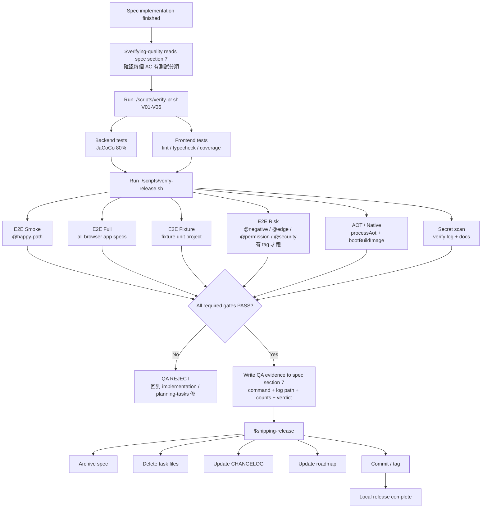

# Skills Hub — QA Strategy

本文件定義 Skills Hub 的產品 QA 策略。它不是只列 command，而是回答三件事：

1. 每個需求在寫 code 前如何變成可驗證例子。
2. Backend / Frontend / E2E / Artifact 各自應該抓哪種錯。
3. Release 前哪些 evidence 必須存在，哪些目前還只是待補 tooling。

## Current Status

目前 repo 內可執行的 canonical release gate 是：

```bash
./scripts/verify-release.sh
```

`verify-release.sh` 會把 log 寫到 `verify-release.log`，是 `$verifying-quality` 與 `$shipping-release` 應呼叫的唯一正式 release gate。日常 spec/task 快速驗證用 `scripts/verify-pr.sh`。

現況重點：

| Area | Current reality |
|------|-----------------|
| Backend tests | `backend/src/test/java` 已有 unit、slice、`@SpringBootTest + Testcontainers`、Spring Modulith Scenario tests。 |
| Backend coverage | `backend/build.gradle.kts` 使用 JaCoCo，`jacocoTestCoverageVerification` gate 為 LINE coverage 80%。 |
| Frontend tests | `frontend/src/**/*.test.*` 使用 Vitest + React Testing Library。 |
| Frontend coverage | `frontend/vite.config.ts` 目前是 include whitelist；不是全 `src/**` coverage。 |
| Browser E2E | `e2e/` 使用 Playwright，打 `skillshub:e2e-local` production packaged image + `compose.e2e.yaml`。 |
| OpenAPI | 目前不列 release gate。`backend/build.gradle.kts` 沒有 SpringDoc dependency；文件與歷史 spec 曾提過 `/v3/api-docs`，但現階段不把它當 QA blocker。 |
| CI build | `cloudbuild.yaml` 目前 build image 時使用 `-x test`；它是 build-push pipeline，不是完整 QA gate。 |
| Logs | `verify-pr.log`、`verify-release.log` 寫在 repo root 且由 `.gitignore` 排除。 |

## QA Gate Model

每個 spec 從設計到 release 應通過下列 gate。若某 gate 不適用，spec §7 必須寫明實際理由與替代 evidence。

| Gate | Name | Required evidence | Blocks release |
|------|------|-------------------|----------------|
| G0 | Spec Examples | 每個 AC 都有 Given / When / Then，且 §6 task plan 對應測試層級。 | Yes |
| G1 | Backend Runtime | Backend AC 以 `@SpringBootTest + Testcontainers` 或等價 slice / unit test 驗證。 | Yes |
| G2 | Backend Coverage | `./gradlew jacocoTestCoverageVerification` PASS，LINE coverage >= 80%。 | Yes |
| G3 | Frontend Behavior | `npm test` + React Testing Library / hook / API client tests PASS。 | Yes |
| G4 | Frontend Static Quality | `npm run verify` PASS；`npm test -- --coverage` PASS。 | Yes |
| G5 | Production Browser E2E | Playwright 打 production image，不打 Vite dev server。Smoke + Full + Fixture gates PASS。 | Yes |
| G6 | Risk / Negative Flows | 涉及權限、惡意輸入、狀態衝突、邊界資料的 spec 有對應 risk tests 或 backend integration tests。 | Yes when applicable |
| G7 | Native / AOT Package | `processAot` + native `bootBuildImage` PASS。 | Yes |
| G8 | Secret / Artifact Cleanliness | log 不洩漏 key；production bootJar 不含 E2E support classes/resources。 | Yes |
| G9 | Release Ledger | spec archive、task cleanup、CHANGELOG、roadmap、tag 由 `$shipping-release` 完成。 | Yes |

### QA Flow



## Script Strategy

### Current executable scripts

目前 QA / release 流程使用兩條 script：

| Script | When | Contents | Log |
|--------|------|----------|-----|
| `scripts/verify-pr.sh` | 每個 spec / task 的快速本機驗證 | Backend test + JaCoCo、frontend test、lint、typecheck、frontend coverage。 | `verify-pr.log` |
| `scripts/verify-release.sh` | `$verifying-quality` PASS 前與 `$shipping-release` 前 | PR gate + E2E Smoke + E2E Full + E2E Fixture + E2E Risk when tags exist + AOT/native + secret leak check。 | `verify-release.log` |

QA / release 文件記錄實際執行的 script、log path、Summary counts 和 Verdict line。

## Verification Command Registry

`$verifying-quality` Step 0.5 以此 table 和 `scripts/verify-release.sh` 對齊。新增或刪除 command 時，script 和本文必須同步。

| ID | Command | Severity | Skip-if | Notes |
|----|---------|----------|---------|-------|
| V01 | `cd backend && ./gradlew clean test jacocoTestReport` | CRITICAL | — | 跑 backend 全部 JUnit tests，包含 pure unit、slice、`@SpringBootTest + Testcontainers`、Modulith boundary tests；產 JaCoCo XML/HTML/CSV。 |
| V02 | parse `backend/build/reports/jacoco/test/jacocoTestReport.csv` | INFO | CSV 不存在 | 顯示 LINE coverage；不是 gate。 |
| V03 | `cd backend && ./gradlew jacocoTestCoverageVerification` | CRITICAL | task 未註冊 | Backend LINE coverage 80% gate；threshold 由 `backend/build.gradle.kts` 管。 |
| V04 | `cd frontend && npm test` | CRITICAL | `frontend/node_modules` 不存在 | Vitest + React Testing Library / hook / API client tests。 |
| V05 | `cd frontend && npm run verify` | CRITICAL | `frontend/node_modules` 不存在 | ESLint `--max-warnings 0` + TypeScript `tsc -b`。 |
| V06 | `cd frontend && npm test -- --coverage` | CRITICAL | `frontend/node_modules` 不存在 | Frontend coverage gate；目前為 include whitelist，不代表全站 coverage。 |
| V07 | `cd e2e && npx playwright test --grep @happy-path` | CRITICAL | `e2e/node_modules` 不存在 / config 不存在 / 無 `@happy-path` | E2E Smoke：production image + Compose + mock OAuth + fixture manifest + core user journeys。 |
| V07b | `cd e2e && SKILLSHUB_E2E_SEMANTIC_FIXTURES=true npx playwright test --project=chromium --grep-invert @bootstrap` | CRITICAL | E2E prerequisites 不存在 | E2E Full：所有 app browser specs，包含非 `@happy-path` 檔案；排除 bootstrap-only smoke。 |
| V07c | `cd e2e && npx playwright test --project="fixture unit"` | CRITICAL | E2E prerequisites 不存在 / fixture spec 不存在 | E2E Fixture：測 DB guard、production API seed helper、projection seed helper。 |
| V07d | four risk tag runs: `@negative`, `@edge`, `@permission`, `@security` | CRITICAL | E2E prerequisites 不存在 / 無 risk tags | E2E Risk：等 tag backfill 後自動納入；目前無 tag 時 SKIP。 |
| V08a | `cd backend && ./gradlew processAot` | CRITICAL | — | AOT bake-time smoke；不得要求真 DB、GCP credential、Secret Manager 或真 Gemini key。 |
| V08b | `cd backend && ./gradlew --no-daemon -x test bootBuildImage --imageName=skillshub-verify:local -Pspring.profiles.active=aot,local` | CRITICAL | `SKIP_NATIVE=1` / Docker unavailable | Full native image build；dev 可明示 opt-out，release 不應跳過。 |
| V09 | `rg` secret-like pattern against current verify log + `docs/grimo` | CRITICAL | `rg` 不存在 | 確認 log/docs 不含真 API key；pattern 要求 Google key prefix 後至少 20 個 token chars，避免 `AIzaSy...` placeholder 誤判。 |

### Future enhancement: deploy smoke

目前 `$shipping-release` 不負責部署，所以本 QA 流程沒有 post-deploy smoke script，流程圖也不把部署環境檢查列為 release 前置條件。

未來若建立 deploy pipeline 或 site-audit automation，可以在那條流程新增 post-deploy smoke：對 staging/prod URL 打 `/actuator/health`、`/`、`/api/v1/skills?page=0&size=1`、`/api/v1/me`，必要時再驗下載 endpoint。這個 evidence 用來證明部署後環境可用，不取代本機 `verify-release.sh`。

OpenAPI contract command 目前不在 planned registry；等產品決定重新啟用 SpringDoc 或改用另一種 contract tooling，再另開 spec。

## Backend QA Rules

Backend 的主要風險在 Spring wiring、PostgreSQL/pgvector、Flyway schema、transaction、Modulith outbox、async projection、security filter chain。只要 AC 碰到這些 runtime 邊界，就不能只靠 pure unit test。

### Required test level by change type

| Change touches | Required test |
|----------------|---------------|
| Domain invariant / parser / mapper / version policy / scanner rule | Pure JUnit test is enough when no Spring or DB behavior is involved. |
| REST endpoint status/body/security branch | `@WebMvcTest` via `WebMvcSliceTestBase`, or `@SpringBootTest + MockMvc` when full security wiring matters. |
| Repository / SQL / migration / projection row | `@DataJdbcTest` via `RepositorySliceTestBase`, or `@SpringBootTest + Testcontainers` when service orchestration matters. |
| Command service that saves aggregates or publishes domain events | `@SpringBootTest + Testcontainers`. |
| `@ApplicationModuleListener` / async projection / outbox | `@SpringBootTest + Testcontainers + @EnableScenarios`; use Modulith `Scenario` instead of long Awaitility waits. |
| Cloud/GCS/storage integration | Testcontainers or emulator-backed integration test; if no test infra exists, `$verifying-quality` returns `REJECT-BLOCKED`. |
| AOT/native-sensitive code | Unit/integration test plus V08a/V08b evidence. |

### Current backend test bases

現有 repo 已經有兩個共用 test base，新增 backend 測試時優先使用它們，讓測試跑相同的 Spring/Testcontainers 設定：

| Base class | Use when | What it proves |
|------------|----------|----------------|
| `RepositorySliceTestBase` | Repository、SQL、Flyway migration、同步 service + DB 行為；不驗 HTTP，不驗 async listener。 | PostgreSQL/pgvector Testcontainers 跑得起、schema 真的套用、row 寫入/查詢結果正確。 |
| `WebMvcSliceTestBase` | Controller status/body/header/security branch；service/repo 用 mock。 | HTTP route、request mapping、JSON shape、Spring Security filter path 正確。 |

OAuth2 Resource Server path 的 controller tests 用 Spring Security test 的 `.with(jwt())` 建 request，不用 `@WithMockUser`。`@WithMockUser` 會走 `UsernamePasswordAuthenticationToken`，不是目前 controller 在 production 會收到的 JWT path。

### Async listener tests

`@ApplicationModuleListener`、outbox、projection listener 的測試首選 Spring Modulith `Scenario`：

```java
@SpringBootTest
@Import(TestcontainersConfiguration.class)
@EnableScenarios
class FooListenerTest {

    @Test
    void publishEvent_triggersListener_writesRow(Scenario scenario) {
        scenario.publish(new SkillCreatedEvent(...))
                .andWaitForStateChange(() -> repo.findById(id).orElse(null))
                .andVerify(row -> assertThat(row.getName()).isEqualTo("demo"));
    }
}
```

`TestcontainersConfiguration` 目前有 `ScenarioCustomizer` default timeout 5s。只有 connection counter、outbox status polling 這類 infra 計數測試才改用 Awaitility；不要把 30s Awaitility 當 async listener 測試的預設解法。

### Backend coverage

Backend coverage is enforced by JaCoCo:

```bash
cd backend && ./gradlew jacocoTestCoverageVerification
```

Gate:

- LINE coverage must be >= 80%.
- Coverage is not enough by itself; AC evidence must still show the behavior was tested at the correct level.
- New production classes with 0% coverage are an IMPORTANT finding even if aggregate coverage still passes.

### Backend BDD traceability

Every backend behavior test should include either:

- `@DisplayName("AC-N: ...")`
- `@Tag("AC-N")`
- or a spec id tag like `@Tag("AC-S203-4")`

Evidence in spec §7 should say what command was run and what user-visible/API/DB result changed.

## Frontend QA Rules

Frontend QA follows a user-behavior rule: test what the user can see, click, type, or receive as an error message. Avoid testing component internals, private state, or CSS class implementation details unless the class itself is the contract being shipped.

### Required test level by change type

| Change touches | Required test |
|----------------|---------------|
| `src/lib` pure functions | Vitest unit test with concrete inputs/outputs. |
| `src/api` client / response mapper | Vitest API client test; assert URL, method, request body, response shape, and error shape. |
| `src/hooks` | Vitest hook test; assert returned state and network calls from the user's scenario. |
| `src/components` | React Testing Library test using role/label/text and `user-event` where interaction matters. |
| `src/pages` | Page-level Vitest test with mocked API responses; assert visible copy, buttons, links, navigation, empty/error states. |
| Layout / mobile / overflow / production-only visual behavior | Playwright browser test if jsdom cannot faithfully verify it. |

### Frontend coverage

Current state: `frontend/vite.config.ts` uses `coverage.include` whitelist. This is allowed as a migration strategy, but it is not full frontend coverage.

Policy from now on:

1. If a spec modifies a frontend production file under `src/pages`, `src/components`, `src/hooks`, `src/api`, or `src/lib`, that file must either already be in coverage include or be added in the same spec.
2. The spec must add or update a behavior test for that file.
3. Do not immediately switch to all `src/**`; expand coverage by touched files first, then by area.
4. A future QA infrastructure spec should migrate coverage include by groups: API/lib first, hooks second, reusable components third, pages last.

Gate:

```bash
cd frontend && npm test -- --coverage
```

The gate must remain 80% for files included in the coverage set.

## Browser E2E Rules

`e2e/` owns browser tests. Browser E2E must run against the production packaged app image, not Vite dev server and not a test-flavored backend app.

Current production-image path:

1. `e2e/scripts/build-e2e-image.sh` builds `skillshub:e2e-local`.
2. `e2e/compose.e2e.yaml` starts disposable PostgreSQL/pgvector, mock OAuth server, and app image.
3. Playwright setup projects create fixture manifest and browser auth state.
4. Browser tests read `e2e/results/fixtures.json`.
5. Aggregate data uses production `/api/v1/*`; projection-only rows may use guarded SQL against disposable `skillshub_e2e`.

### E2E gate taxonomy

| Gate | Tag / project | Command shape | Purpose |
|------|---------------|---------------|---------|
| E2E Smoke | `@happy-path` | `npx playwright test --grep @happy-path` | Core user journeys every release. |
| E2E Full | app specs | `npx playwright test --project=chromium --grep-invert @bootstrap` | All app browser specs, including non-happy-path files already written. |
| E2E Fixture | `fixture unit` project | `npx playwright test --project="fixture unit"` | Proves the fixture runner and DB guard are trustworthy. |
| E2E Risk | `@negative`, `@edge`, `@permission`, `@security` | see command block below | User mistakes, bad data, auth/permission, malicious input. |

### E2E tag rules

Use these tags in browser tests:

| Tag | Meaning |
|-----|---------|
| `@happy-path` | Core product journey; included in Smoke. |
| `@negative` | Empty input, duplicate data, malformed data, failed validation. |
| `@edge` | Boundary values, long lists, pagination, mobile/viewport edge, race-prone UI. |
| `@permission` | Login, role, authz denied, cross-user / cross-scope behavior. |
| `@security` | XSS, path traversal, sensitive data exposure, forbidden test route exposure. |
| `@fixture` | Test fixture tooling only; not a product flow. |
| `@profile-empty` / `@profile-single` / `@profile-paged` | Fixture state shape required by the scenario. |

### Current E2E selection

Current `@happy-path` Smoke includes S140, S172, S193, S203 browser flows. Full browser run should additionally include existing non-Smoke app specs such as S176, S187, and S195.

`e2e/tests/smoke.spec.ts` is bootstrap-only and should not be part of release Full gate.

Risk gate can be run as four explicit Playwright invocations until a helper script exists:

```bash
cd e2e
SKILLSHUB_E2E_SEMANTIC_FIXTURES=true npx playwright test --grep @negative
SKILLSHUB_E2E_SEMANTIC_FIXTURES=true npx playwright test --grep @edge
SKILLSHUB_E2E_SEMANTIC_FIXTURES=true npx playwright test --grep @permission
SKILLSHUB_E2E_SEMANTIC_FIXTURES=true npx playwright test --grep @security
```

## Risk / Negative Coverage

Every user-facing workflow should eventually have at least one executable scenario for each relevant risk category:

| Category | Examples |
|----------|----------|
| Empty / null | Blank search, empty upload, empty collection selection. |
| Boundary | Long query, large package, page boundary, mobile width, many results. |
| Format mismatch | Malformed UUID, invalid version, non-zip upload, invalid enum. |
| State conflict | Duplicate skill name, suspended skill download/edit, stale version update. |
| Permission denied | Anonymous write, viewer admin action, non-owner edit/share. |
| Malicious input | XSS text, SQL-like query, path traversal filename, secret-looking payload. |
| Concurrent / race | Rapid search changes, duplicate publish attempts, async projection lag. |

Backend integration tests may cover a category when browser E2E would be slower and not more informative. Browser E2E is required when the behavior depends on real page routing, real auth session, production static assets, or user-visible DOM state.

## OpenAPI / API Contract

OpenAPI is not a release gate right now.

Reason:

- `backend/build.gradle.kts` currently does not include SpringDoc.
- `/v3/api-docs` and `/swagger-ui` appear in historical docs and frontend dev proxy comments, but they are not backed by current backend dependency configuration.

Current API contract evidence comes from:

- Backend controller tests (`@WebMvcTest` / MockMvc).
- Backend integration tests for request/response behavior.
- Frontend API client tests asserting URL, method, payload, response shape, and error mapping.
- Browser E2E hitting production `/api/v1/*`.

If the product wants OpenAPI again, create a dedicated QA infrastructure spec that:

1. Adds the chosen OpenAPI tooling.
2. Defines exposure by profile.
3. Adds contract tests.
4. Adds a registry command.
5. Updates this section from "not a gate" to "release gate".

## Secret And Artifact Rules

### Log and secret handling

V07 may load `SKILLSHUB_E2E_GENAI_API_KEY` from `backend/config/application-secrets.properties`, but logs must only show redacted status.

Release evidence must include:

```bash
rg "AIza[0-9A-Za-z_-]{20,}|SKILLSHUB_E2E_GENAI_API_KEY=[A-Za-z0-9_-]{20,}|skillshub\\.genai\\.api-key=[A-Za-z0-9_-]{20,}" verify-release.log docs/grimo
```

Expected: no match.

### Production artifact cleanliness

`backend/build.gradle.kts` defines `assertProductionArtifactClean`. It must remain attached to `check` and must fail if production bootJar contains E2E support classes/resources such as test reset controllers or `application-e2e`.

## AC-To-Test Contract

Every spec AC must be classified before implementation:

| Classification | Meaning |
|----------------|---------|
| Backend runtime | Verified by JUnit / Spring / Testcontainers. |
| Frontend behavior | Verified by Vitest / React Testing Library. |
| Browser E2E | Verified by Playwright production image. |
| Evidence-only | File/config/docs-only change; verified by command output or grep. |
| Manual-ready | Human can verify in under 5 minutes from written instructions. |
| Untestable | Should be executable but lacks infrastructure; blocks shipping. |

Test names should include AC IDs:

```java
@Test
@DisplayName("AC-1: upload valid SKILL.md publishes a skill")
@Tag("AC-1")
void uploadValidSkill_publishesSkill() {
    // ...
}
```

```typescript
it('AC-1: upload valid SKILL.md publishes a skill', async () => {
  // ...
})
```

Evidence-only ACs are allowed only when there is no production behavior change, for example build config, documentation, or script registry updates. A production code change must have executable behavior evidence.

## Verifying-Quality Protocol

`$verifying-quality` applies this checklist:

1. Read spec, PRD, architecture, development standards, QA strategy, and relevant code.
2. Confirm every AC has a verification classification.
3. Reconcile this command registry with actual build/package scripts.
4. Run the applicable executable gate.
5. Inspect coverage output and test evidence.
6. Confirm browser E2E used production image when UI/runtime assembly is affected.
7. Confirm no OpenAPI gate is claimed unless OpenAPI tooling exists.
8. Record command, log path, summary counts, and verdict in spec §7.
9. Return `REJECT-BLOCKED` if a required verification capability does not exist.

## Local Development Commands

```bash
# Backend local app; Spring Boot starts Docker Compose dependencies as configured.
cd backend && ./gradlew bootRun

# Backend tests and coverage.
cd backend && ./gradlew clean test jacocoTestReport
cd backend && ./gradlew jacocoTestCoverageVerification

# Frontend dev server and checks.
cd frontend && npm run dev
cd frontend && npm test
cd frontend && npm run verify
cd frontend && npm test -- --coverage

# Browser E2E; Playwright starts production-image Compose target through webServer.
cd e2e && SKILLSHUB_E2E_SEMANTIC_FIXTURES=true npx playwright test --grep @happy-path
cd e2e && SKILLSHUB_E2E_SEMANTIC_FIXTURES=true npx playwright test --project=chromium --grep-invert @bootstrap
cd e2e && npx playwright test --project="fixture unit"

# Fast local gate for spec/task work.
./scripts/verify-pr.sh

# Full local release gate.
./scripts/verify-release.sh

```

## Maintenance Rules

- Changing registry commands requires updating this file and the relevant `scripts/verify-*.sh` file in the same change.
- Changing E2E runtime, fixture profiles, or Playwright project graph requires updating `docs/grimo/architecture.md`, `docs/grimo/development-standards.md`, and `docs/grimo/test-cases.md` when their claims change.
- Adding frontend production files should update `frontend/vite.config.ts` coverage include according to the touched-file policy.
- Adding backend dependencies must respect BOM-managed versions and update `docs/grimo/architecture.md` dependency table when the dependency is product-relevant.
- OpenAPI must not be described as available or verified until the backend dependency and tests exist again.
