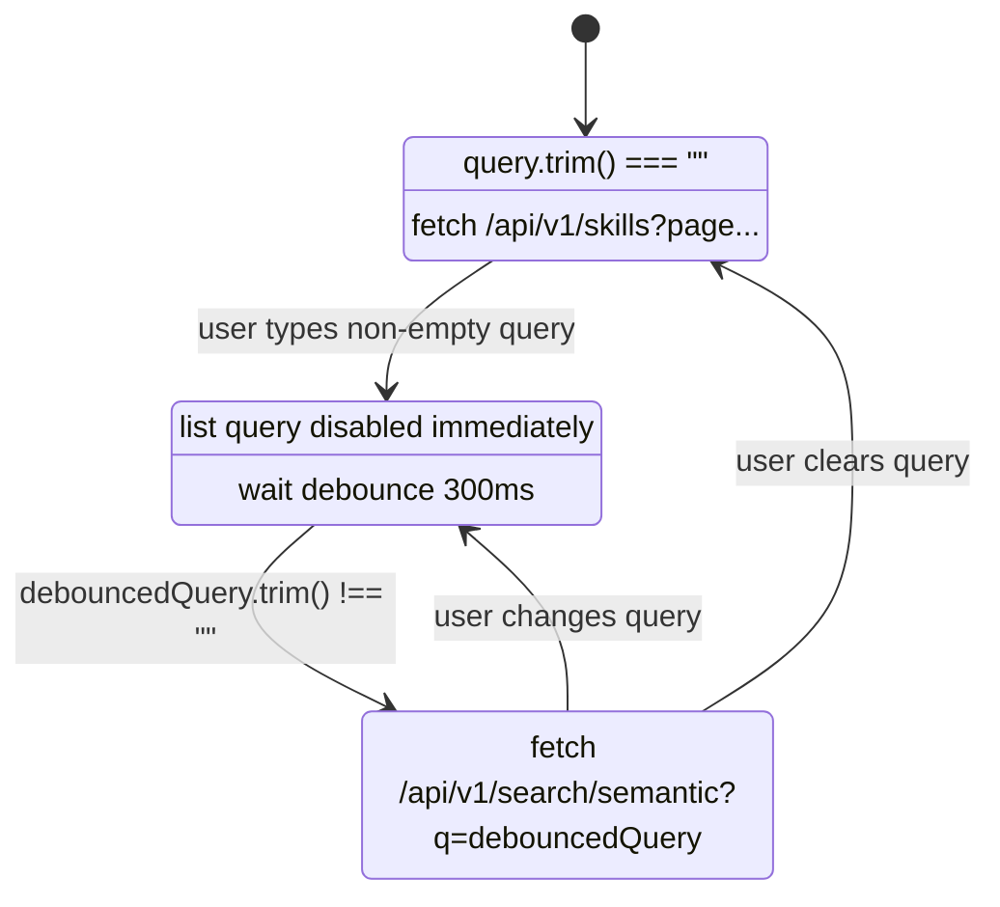

# S178 — Browse Search Entry Point Cleanup

> SpecID: S178
> Status: ⏳ in-progress
> Date: 2026-05-15
> Size: S(9)
> Related: S157 semantic search LAB enablement, S177 is_public-first search visibility, S094b dedicated semantic search page (superseded at UI route level by S178), S104 filter-active empty state, S106 browse sort mapping

---

## 1. Goal

`frontend/src/pages/HomePage.tsx:56` 目前在 `/browse` 輸入搜尋字串時會跑 `useSemanticSearch(query)`，同一個 render 又在 `frontend/src/pages/HomePage.tsx:65` 跑 `useSkillList({ keyword: query.trim() })`。使用者打 `dd` 時，瀏覽器 Network 會看到：

```text
GET /api/v1/search/semantic?q=d
GET /api/v1/skills?keyword=d&page=0&size=20&sort=downloadCount%2Cdesc
GET /api/v1/search/semantic?q=dd
GET /api/v1/skills?keyword=dd&page=0&size=20&sort=downloadCount%2Cdesc
```

S178 要把 Skills Hub 的使用者搜尋入口收斂成 `/browse`，並把 `/browse` 的資料來源改成明確二選一：

| 畫面狀態 | 前端可打的 API | 不可打的 API | 畫面 |
| --- | --- | --- | --- |
| 搜尋框空白 | `GET /api/v1/skills?page=0&size=20&sort=...` | `/api/v1/search/semantic` | 瀏覽列表、分類、風險篩選、排序、分頁 |
| 搜尋框有字 | `GET /api/v1/search/semantic?q=...` | `/api/v1/skills?keyword=...` | 語意搜尋結果、相似度、不顯示分類與分頁 |
| 清空搜尋框 | `GET /api/v1/skills?page=0&size=20&sort=...` | `/api/v1/search/semantic?q=` | 回到未篩選瀏覽列表 |

S177 的 visibility 修復是 ordering-only dependency：S178 不 import S177 的 production type，也不改 SQL visibility 規則；但 release 順序上，S177 要先修好 private skill semantic leak，否則 S178 只會讓 `/browse` 更穩定地只走 semantic endpoint，仍會看到錯誤的 private 結果。

`/search?q=...` 不再保留為 legacy deep link，也不 redirect。正常產品路徑沒有任何主流程連到 `/search`；只保留會讓搜尋有兩套畫面規則。S178 implementation 要移除 `/search` route 與 dedicated `SearchResultsPage`，讓直接開 `/search` 的使用者走現有 not-found route，並把文件或測試入口改到 `/browse`。

`/api/v1/search/intent` 與 `IntentSummaryCard` 跟 `/search` 是同一條已移除的搜尋頁支線。S178 implementation 要一起刪除 intent summary frontend/backend 能力，避免留下沒有畫面使用、但仍需要 LLM wiring / native reflection / API docs 維護的殘留功能。

Domain language note: per root `CONTEXT.md`, `GET /api/v1/skills?keyword=` is a **Keyword Filter** API capability, not a user-visible `/browse` mode.

---

## 2. Research And Design

### 2.1 Current State

`frontend/src/pages/HomePage.tsx:40` 的註解寫「語意搜尋（自然語言）與關鍵字搜尋（fallback）」，但實際行為不是「fallback 後備」，而是兩支 query 同時啟動：

- `HomePage.tsx:56-61`：`useSemanticSearch(query)`；`useSemanticSearch.ts:18` 在 `query.trim().length > 0` 時自動 fetch。
- `HomePage.tsx:65-71`：`useSkillList({ keyword: query.trim() || undefined, ... })`；`useSkillList.ts:12-20` 沒有 `enabled` 參數，所以每次 query 改變都會 fetch list。
- `HomePage.tsx:78-80`：只有 semantic 有結果時才進 `isSemanticMode`。semantic 回空陣列或 error 時，畫面落回 list mode，造成 `/api/v1/skills?keyword=` 變成隱性 fallback。
- `frontend/src/pages/SearchResultsPage.tsx:35` 是 dedicated semantic page，只呼叫 `useSemanticSearch(query)`，但主產品流程沒有入口；S178 刪除這個 UI route，避免 `/browse` 與 `/search` 同時代表搜尋。
- `frontend/src/pages/SearchResultsPage.tsx:36` 是唯一呼叫 `useSearchIntent(query)` 的 production page；刪 `/search` 後 intent summary 沒有使用者入口。
- `backend/src/main/java/io/github/samzhu/skillshub/search/SearchIntentController.java:28` 提供 `POST /api/v1/search/intent`；S178 刪除，因為它只服務已移除的 dedicated search page。

PRD 約束：

- `docs/grimo/PRD.md:65-69` 的 P1 keyword search 說「輸入 docker → name/description 含 docker 的 skills」；這是 keyword API 的產品能力，不代表 `/browse` 的同一個輸入框要同時打 keyword + semantic。
- `docs/grimo/PRD.md:179-184` 的 P5 semantic search 說「自然語言搜尋 → 回傳語意相關 skills，且不要求使用者知道確切 skill 名稱」；`/browse` 輸入框目前更像 P5 entry point。
- `docs/grimo/PRD.md:192-196` 的 semantic zero-result 行為是顯示「未找到匹配的技能」並建議調整描述或瀏覽分類，不是自動改跑 keyword fallback。

API 文件差異：

- `frontend/src/api/search.ts:13-16` 和 production Network 都使用 `GET /api/v1/search/semantic?q=...`。
- `docs/grimo/architecture.md:554` 仍寫 `POST /api/v1/search/semantic`；S178 implementation 應同步更正該文件列，不改 runtime API。

### 2.2 Framework Facts

Frontend 使用 `@tanstack/react-query` `^5.100.1`（`frontend/package.json:17`）。TanStack Query v5 官方文件說 `enabled` 可以讓 query 在條件成立前不自動執行，常見例子是 filter 有值後才 fetch。這正好符合 S178：搜尋框有字時停掉 list query，搜尋框空白時停掉 semantic query。

TanStack Query v5 paginated queries 文件也說 `placeholderData: keepPreviousData` 可以在 page query key 改變時保留上一頁資料直到新資料回來；現有 `useSkillList.ts:19` 已採用。S178 會保留這個行為給 catalog/list mode，不把它套到 semantic mode，避免搜尋時顯示上一個列表造成誤會。

Research citations:

- TanStack Query v5 `enabled` docs: <https://tanstack.com/query/v5/docs/framework/react/guides/disabling-queries> — `enabled` 可用於條件式啟停 query，例如 filter 有值才 fetch。
- TanStack Query v5 paginated queries docs: <https://tanstack.com/query/latest/docs/framework/react/guides/paginated-queries> — `placeholderData: keepPreviousData` 適合翻頁列表，能在 page query key 變更期間保留上一頁資料。

### 2.3 Approaches

| Option | 改哪裡 | 使用者實際看到 | 成本 |
| --- | --- | --- | --- |
| A. 保留現況 dual query，只在 S177 後讓兩支 API 都安全 | 不改 `HomePage.tsx`，只靠 S177 backend visibility | 打 `dd` 還是看到 semantic + keyword 兩支 API；semantic 無結果時畫面可能切回 keyword list | 最省，但 Network 邏輯仍亂，和使用者本次觀察不符 |
| B. `/browse` 只做 catalog，搜尋送到 `/search?q=...` | `HomePage.tsx` search submit 時 navigate；`SearchResultsPage.tsx` 繼續 semantic | `/browse` 不再直接顯示搜尋結果；輸入後跳頁 | 被拒：主產品流程沒有 `/search` 入口，保留會讓搜尋有兩套畫面規則 |
| C. `/browse` 保留搜尋框，但 query 非空時只跑 semantic，並刪除 `/search` route + intent summary 支線（recommended） | `HomePage.tsx` 狀態機、`useSkillList` 加 `enabled`，加 debounce hook；`App.tsx` 移除 `/search`；刪 `SearchResultsPage` / `useSearchIntent` / `IntentSummaryCard` / backend intent API；文件/test 改走 `/browse` | 空白是 catalog；有字是 semantic；清空回 catalog；Network 不再出現 `/skills?keyword=`；產品只剩一個搜尋入口 | 改動仍集中搜尋 surface；會減少一條無主流程使用的 LLM API |

Chosen approach: C。

### 2.4 State Machine



Key rules:

- `hasSearchInput = query.trim().length > 0` 是畫面模式的唯一判斷，不再用「semantic 有沒有結果」決定 fallback。
- `debouncedQuery = useDebouncedValue(query.trim(), 300)` 是 semantic request 的 query string。使用者快速輸入 `d` 再輸入 `dd`，300ms 內只應送出 `q=dd`。
- `/browse` stays live-search: text changes start semantic search after debounce, without requiring Enter or a submit button.
- `/search?q=...` is removed; implementation must not keep a second user-visible search results route.
- `/api/v1/search/intent` is removed with `/search`; `/browse` semantic mode must not call an intent-summary API.
- `useSkillList` 在 `hasSearchInput === true` 時 `enabled: false`，並且不傳 `keyword`。
- Entering semantic mode clears `category`, `riskFilter`, and `page`; clearing search returns to unfiltered catalog mode.
- Semantic 回空陣列時仍留在 semantic mode，顯示 existing `EmptyState`，不自動打 `/api/v1/skills?keyword=...`。
- Semantic error 時顯示 `搜尋失敗，請調整描述或清除搜尋後瀏覽全部技能`，不自動回 catalog。使用者可清空搜尋回 catalog。
- Catalog error keeps the existing `載入技能失敗，請重新整理頁面` wording.

### 2.5 Low-Fidelity UI Sketch

Catalog mode (`/browse`, query empty):

```text
探索 Agent 技能                                  [發布技能]
為團隊發現、評估與安裝可信任的 AI agent 技能

[ 搜尋技能、任務或工具...                         ]

┌───────────────┐  共 103 個技能                 [推薦][最新][風險低][下載最多]
│ 風險篩選       │  ┌──────────────┐ ┌──────────────┐
│ 分類           │  │ SkillCard     │ │ SkillCard     │
└───────────────┘  └──────────────┘ └──────────────┘
                  [上一頁] 第 1 / 6 頁 [下一頁]
```

Semantic mode (`/browse`, query non-empty):

```text
探索 Agent 技能                                  [發布技能]
為團隊發現、評估與安裝可信任的 AI agent 技能

[ dd                                                   x ]

找到 2 個相關技能
┌──────────────┐ ┌──────────────┐
│ SkillCard     │ │ SkillCard     │
│ score badge   │ │ score badge   │
└──────────────┘ └──────────────┘
```

Semantic zero-result:

```text
[ dd                                                   x ]

這個描述還沒有匹配的技能。
現有技能與你描述的概念相似度都偏低。可以調整描述、清除搜尋並瀏覽分類，或邀請團隊發布。
[清除描述並瀏覽全部技能] [發布這個技能]
```

The sketch intentionally keeps the current page composition. S178 is about request routing and mode clarity, not a visual redesign.

---

## 3. Acceptance Criteria

### AC-S178-1 — Initial Browse Uses Catalog API Only

Given user opens `/browse` with an empty search box
When the page finishes initial data loading
Then frontend sends `GET /api/v1/skills?page=0&size=20&sort=downloadCount%2Cdesc`
And frontend does not send `/api/v1/search/semantic`
And the page shows category/risk sidebars, sort chips, and pagination when total pages > 1.

### AC-S178-2 — Search Input Uses Semantic API Only

Given user is on `/browse`
When user types `dd` in the search box and the debounce delay completes
Then frontend sends `GET /api/v1/search/semantic?q=dd`
And frontend does not send `GET /api/v1/skills?keyword=dd`
And the page hides category/risk sidebars and pagination while showing semantic result count.

### AC-S178-3 — Fast Typing Sends Only The Final Debounced Query

Given user is on `/browse`
When user types `d`, then types `dd` within 300ms
Then frontend does not send `GET /api/v1/search/semantic?q=d`
And after 300ms it sends exactly one semantic request for `q=dd`
And it sends zero `/api/v1/skills?keyword=` requests during the search.

### AC-S178-4 — Semantic Zero Result Does Not Keyword-Fallback

Given `/api/v1/search/semantic?q=dd` returns `[]`
When user searches `dd` on `/browse`
Then the page stays in semantic mode and shows the semantic empty state
And frontend does not send `/api/v1/skills?keyword=dd`.

### AC-S178-5 — Semantic Error Does Not Keyword-Fallback

Given `/api/v1/search/semantic?q=dd` returns a non-2xx response
When user searches `dd` on `/browse`
Then the page shows `搜尋失敗，請調整描述或清除搜尋後瀏覽全部技能`
And frontend does not send `/api/v1/skills?keyword=dd`
And clearing the search box returns to catalog mode.

### AC-S178-6 — Clearing Search Returns To Catalog API

Given user selected a category or risk filter, then searched `dd` on `/browse`
When user clears the search box
Then frontend sends `GET /api/v1/skills?page=0&size=20&sort=downloadCount%2Cdesc` without `keyword`, `category`, or hidden risk filter state
And category/risk sidebars and pagination return to unfiltered catalog browsing.

### AC-S178-7 — `/skills` Alias Keeps Same Behavior

Given `/skills` routes to `HomePage` through `frontend/src/App.tsx`
When user searches from `/skills`
Then the same request routing rules from AC-S178-1 through AC-S178-6 apply.

### AC-S178-8 — Dedicated `/search` Route Is Removed

Given user navigates directly to `/search` or `/search?q=dd`
When the frontend router resolves the path
Then it does not render `SearchResultsPage`
And it does not redirect to `/browse`
And it falls through to the normal not-found route
And the product has no visible link or CTA pointing to `/search`
And semantic search E2E coverage opens `/browse` instead.

### AC-S178-9 — Intent Summary Capability Is Removed

Given the dedicated `/search` page is removed
When the application is built and tests run
Then no production frontend code imports `IntentSummaryCard` or `useSearchIntent`
And no production backend code registers `POST /api/v1/search/intent`
And REST docs no longer list `/api/v1/search/intent`.

### AC-S178-10 — Semantic Search Docs Point To Browse

Given user opens `/docs/semantic-search`
When they click the semantic-search trial CTA
Then the CTA label is `前往瀏覽頁試試語意搜尋 →`
And the link target is `/browse`
And no docs page links to `/search`.

### AC-S178-11 — Browser E2E Verifies Browse Search Network Contract

Given Playwright opens `/browse`
When it types `images and containers in CI` in the search box
Then the page shows semantic results
And the browser request log contains `/api/v1/search/semantic?q=`
And the browser request log does not contain `/api/v1/skills?keyword=`.

### AC-S178-12 — Search Placeholder Matches Semantic Entry

Given user opens `/browse`
When the search input is visible
Then its placeholder is `描述你想完成的任務或搜尋技能...`
And the UI does not prompt the user to search by database fields such as `名稱、描述或分類`.

### NFR Sweep

| Category | Requirement |
| --- | --- |
| Performance | AC-S178-3 caps quick typing to one semantic request after 300ms and zero keyword fallback requests. |
| Security | S178 does not decide read permission. Visibility must still be enforced by S177 backend/projection rules; S178 must not add client-side filtering as a security mechanism. |
| Reliability | AC-S178-4 and AC-S178-5 prove semantic empty/error states do not silently replace results with keyword list data. |
| Usability | AC-S178-1, AC-S178-2, and AC-S178-6 prove the page has one visible mode at a time: catalog or semantic. |
| Maintainability | `HomePage` must expose explicit state names (`hasSearchInput`, `debouncedQuery`, `isCatalogMode`, `isSemanticMode`) instead of deriving mode from result length; AC-S178-9 removes the unused intent-summary code path. |

---

## 4. Implementation Contract

### 4.1 Frontend Data Contracts

`frontend/src/hooks/useDebouncedValue.ts`:

```ts
export function useDebouncedValue<T>(value: T, delayMs: number): T
```

Behavior:

- Returns the previous value until `delayMs` passes without a new `value`.
- Clears pending timers on unmount or value change.
- Uses React `useEffect` and `useState`; no new dependency.

`frontend/src/hooks/useSkillList.ts`:

```ts
interface UseSkillListOptions {
  enabled?: boolean
}

export function useSkillList(
  params: SkillSearchParams,
  options?: UseSkillListOptions,
)
```

Behavior:

- Defaults `enabled` to `true`, preserving every existing caller.
- Passes `enabled: options?.enabled ?? true` to `useQuery`.
- Keeps `placeholderData: keepPreviousData` for catalog pagination.

`frontend/src/pages/HomePage.tsx`:

```ts
const trimmedQuery = query.trim()
const debouncedQuery = useDebouncedValue(trimmedQuery, 300)
const hasSearchInput = trimmedQuery.length > 0
const isSemanticMode = hasSearchInput
const isCatalogMode = !hasSearchInput
const isDebouncingSearch = hasSearchInput && debouncedQuery !== trimmedQuery

const semanticQuery = debouncedQuery
const semantic = useSemanticSearch(semanticQuery)
const list = useSkillList(
  {
    category: category ?? undefined,
    page,
    size: 20,
    sort: sortMode,
  },
  { enabled: isCatalogMode },
)
```

Required corrections:

- Remove `keyword: query.trim() || undefined` from `useSkillList`.
- Remove `semanticResults.length > 0` from `isSemanticMode`.
- Disable list query immediately when `hasSearchInput` is true, even while debounce is waiting.
- Semantic loading should include `isDebouncingSearch || semanticLoading`.
- Existing category/risk sidebar condition should use `isCatalogMode`.
- Existing semantic `EmptyState` should stay visible for empty semantic result.

### 4.2 File Plan

| File | Change |
| --- | --- |
| `frontend/src/hooks/useDebouncedValue.ts` | Add small generic debounce hook. |
| `frontend/src/hooks/useDebouncedValue.test.tsx` | Test timer behavior with Vitest fake timers. |
| `frontend/src/hooks/useSkillList.ts` | Add optional `enabled` option; keep default behavior. |
| `frontend/src/pages/HomePage.tsx` | Replace dual-query fallback with explicit catalog/semantic mode state; split catalog vs semantic error copy; remove user-facing "keyword mode" wording from zero-result copy. |
| `frontend/src/components/SearchBar.tsx` | Change placeholder to `描述你想完成的任務或搜尋技能...`. |
| `frontend/src/components/SearchBar.test.tsx` | Update placeholder assertions. |
| `frontend/src/App.tsx` | Remove `/search` route. |
| `frontend/src/pages/SearchResultsPage.tsx` | Delete dedicated search results page. |
| `frontend/src/pages/SearchResultsPage.test.tsx` | Delete route-specific tests; migrate any still-useful assertions into `HomePage.test.tsx`. |
| `frontend/src/hooks/useSearchIntent.ts` | Delete hook. |
| `frontend/src/components/IntentSummaryCard.tsx` | Delete component. |
| `frontend/src/components/IntentSummaryCard.test.tsx` | Delete component tests. |
| `frontend/src/api/search.ts` | Remove `fetchSearchIntent` and `IntentResponse`; keep `fetchSemanticSearch`. |
| `backend/src/main/java/io/github/samzhu/skillshub/search/SearchIntentController.java` | Delete controller and `POST /api/v1/search/intent`. |
| `backend/src/main/java/io/github/samzhu/skillshub/search/SearchIntentService.java` | Delete service. |
| `backend/src/main/java/io/github/samzhu/skillshub/search/SearchNativeConfig.java` | Delete if it only exists for `SearchIntentService.LlmIntentOutput`. |
| `backend/src/main/java/io/github/samzhu/skillshub/shared/ai/AiModelConfig.java` | Remove `searchIntentChatClient` bean if no remaining consumer exists. |
| `backend/src/test/java/**/SearchIntent*` | Delete or update tests tied only to intent summary. |
| `backend/src/test/java/io/github/samzhu/skillshub/search/SearchConfigRegressionTest.java` | Remove `LlmIntentOutput` native-hint expectation tied to deleted intent summary. |
| `backend/src/test/java/io/github/samzhu/skillshub/shared/aot/StructuredOutputNativeHintCoverageTest.java` | Remove `SearchIntentService.LlmIntentOutput` from expected structured-output targets after production target deletion. |
| `backend/src/test/java/io/github/samzhu/skillshub/shared/ai/AiModelConfigTest.java` | Remove `searchIntentChatClient` bean expectation after deleting the only consumer. |
| `frontend/src/pages/docs/SemanticSearchPage.tsx` | Change "試試語意搜尋" CTA from `/search` to `/browse`. |
| `frontend/src/pages/HomePage.test.tsx` | Add AC-S178 tests for initial catalog, search semantic-only, debounce, zero result, error, clear search. |
| `e2e/tests/S140-critical-path-semantic-search.spec.ts` | Open `/browse`, type into the search box, assert semantic request exists and `/skills?keyword=` does not. |
| `frontend/src/pages/docs/RestApiPage.tsx` | Remove `/api/v1/search/intent` row. |
| `docs/grimo/architecture.md` | Correct search semantic API row from `POST` to current `GET`; remove `/api/v1/search/intent` if listed; remove `searchIntentChatClient` from AI wiring text. |
| `docs/grimo/debugging-playbook.md` | Remove or mark obsolete active note about `SearchIntentService.LlmIntentOutput` once the target is deleted. |
| `docs/grimo/specs/2026-05-15-S178-browse-search-request-routing.md` | Add §6 task plan and §7 results during `/planning-tasks`. |

### 4.3 Out Of Scope

- No backend semantic visibility fix; S177 owns `skills.is_public`, ACL, and `vector_store` read scope.
- No removal of `GET /api/v1/skills?keyword=...`; API compatibility stays. S178 only stops `/browse` from using keyword as hidden fallback.
- No user-facing "keyword mode" wording; **Keyword Filter** remains API vocabulary only.
- No URL query string source-of-truth for `/browse` search input. That is a separate navigation/history spec if needed.

---

## 5. Task Boundary Hints

### T01 — Debounce Hook And Query Enabled Contract

Files:

- `frontend/src/hooks/useDebouncedValue.ts`
- `frontend/src/hooks/useDebouncedValue.test.tsx`
- `frontend/src/hooks/useSkillList.ts`

BDD focus:

- `useDebouncedValue("d", 300)` does not publish `"d"` until timers advance.
- Updating to `"dd"` before 300ms publishes only `"dd"`.
- `useSkillList(params, { enabled: false })` does not call `fetchSkills`.
- Existing callers without options still call `fetchSkills`.

Verification:

```bash
cd frontend && npm test -- useDebouncedValue useSkillList
```

### T02 — HomePage Request Routing State Machine

Files:

- `frontend/src/pages/HomePage.tsx`
- `frontend/src/pages/HomePage.test.tsx`

BDD focus:

- AC-S178-1 through AC-S178-7.
- Test should inspect `globalThis.fetch.mock.calls` and assert no URL contains `/api/v1/skills?keyword=`.
- Use fake timers for AC-S178-3 so `q=d` is provably not sent.

Verification:

```bash
cd frontend && npm test -- HomePage
```

### T03 — Remove Dedicated Search Route And Intent Summary

Files:

- `frontend/src/App.tsx`
- `frontend/src/pages/SearchResultsPage.tsx`
- `frontend/src/pages/SearchResultsPage.test.tsx`
- `frontend/src/hooks/useSearchIntent.ts`
- `frontend/src/components/IntentSummaryCard.tsx`
- `frontend/src/components/IntentSummaryCard.test.tsx`
- `frontend/src/api/search.ts`
- `backend/src/main/java/io/github/samzhu/skillshub/search/SearchIntentController.java`
- `backend/src/main/java/io/github/samzhu/skillshub/search/SearchIntentService.java`
- `backend/src/main/java/io/github/samzhu/skillshub/search/SearchNativeConfig.java`
- `backend/src/main/java/io/github/samzhu/skillshub/shared/ai/AiModelConfig.java`

BDD focus:

- AC-S178-8 and AC-S178-9.
- `rg "/search\\?|/api/v1/search/intent|IntentSummaryCard|useSearchIntent"` should show no production caller except archived docs/changelog.

Verification:

```bash
cd frontend && npm test
cd backend && ./gradlew test --tests "*Search*" -x processTestAot -x compileAotTestJava -x aotTestClasses
```

### T04 — Documentation Sync And Final Frontend Verify

Files:

- `docs/grimo/architecture.md`
- `frontend/src/pages/docs/RestApiPage.tsx`
- `frontend/src/pages/docs/SemanticSearchPage.tsx`
- `e2e/tests/S140-critical-path-semantic-search.spec.ts`
- `docs/grimo/specs/2026-05-15-S178-browse-search-request-routing.md`

BDD focus:

- Architecture API table reflects current runtime `GET /api/v1/search/semantic`.
- Docs do not link to `/search`; `/docs/semantic-search` CTA points to `/browse`; REST docs do not list `/api/v1/search/intent`.
- E2E semantic search opens `/browse` and verifies the browser request log does not include `/api/v1/skills?keyword=`.
- Spec §7 records the fetch URLs observed by tests.

Verification:

```bash
cd frontend && npm test
git diff --check
```

---

## 6. Task Plan

| Task | File | ACs | Status | Verification |
| --- | --- | --- | --- | --- |
| S178-T01 | `docs/grimo/tasks/2026-05-16-S178-T01-debounce-query-enabled.md` | AC-S178-2, AC-S178-3 | PASS | `cd frontend && npm test -- useDebouncedValue useSkillList HomePage SearchBar` |
| S178-T02 | `docs/grimo/tasks/2026-05-16-S178-T02-homepage-request-routing.md` | AC-S178-1 through AC-S178-7, AC-S178-12 | PASS | `cd frontend && npm test -- useDebouncedValue useSkillList HomePage SearchBar` |
| S178-T03 | `docs/grimo/tasks/2026-05-16-S178-T03-remove-search-route-intent.md` | AC-S178-8, AC-S178-9 | PASS | `cd frontend && npm test -- App`; `cd frontend && npm run verify`; `cd backend && ./gradlew test --tests "*Search*" --tests "*AiModelConfigTest" --tests "*StructuredOutputNativeHintCoverageTest"` |
| S178-T04 | `docs/grimo/tasks/2026-05-16-S178-T04-docs-e2e-sync.md` | AC-S178-10, AC-S178-11 | PASS | `cd frontend && npm test -- SemanticSearchPage`; `cd frontend && npm run verify`; `cd e2e && npx playwright test --grep @S178` |

## 7. Results

### 2026-05-16 — S178-T01/T02 PASS

Confirmed current bug from real source:

- `frontend/src/pages/HomePage.tsx` was calling `useSemanticSearch(query)` and `useSkillList({ keyword: query.trim() })` in the same render.
- `frontend/src/App.tsx` still has `/search` route; docs and E2E still point to `/search`. These remain for S178-T03/T04.

Implemented:

- `useDebouncedValue(value, 300)` publishes only the final stable search text.
- `useSkillList(params, { enabled:false })` prevents catalog list fetch while search input is non-empty.
- `/browse` now treats `query.trim().length > 0` as semantic mode, not "semantic only if results exist".
- `/browse` search no longer passes `keyword` to `/api/v1/skills`.
- Semantic empty/error states stay in semantic mode and do not fallback to keyword list.
- SearchBar placeholder now says `描述你想完成的任務或搜尋技能...`.

Verification:

```bash
cd frontend && npm test -- useDebouncedValue useSkillList HomePage SearchBar
```

Result: PASS — 4 test files / 20 tests.

### 2026-05-16 — S178-T03 PASS

Confirmed current bug from real route table:

- `frontend/src/App.tsx` still routed `/search` to `SearchResultsPage`; the RED test opened `/search?q=dd` and could not find `404`.
- `SearchResultsPage` was the only production frontend caller of `useSearchIntent`, and `SearchIntentController` was the backend registration point for `POST /api/v1/search/intent`.

Implemented:

- Removed `/search` from the React route table; direct `/search` and `/search?q=dd` now fall through to existing `NotFoundPage`.
- Deleted `SearchResultsPage`, `useSearchIntent`, `IntentSummaryCard`, frontend intent API client, backend intent controller/service/native hint, and `searchIntentChatClient`.
- Removed intent-summary expectations from backend tests and removed the REST quick-reference row for the deleted endpoint.

Verification:

```bash
cd frontend && npm test -- App
cd frontend && npm run verify
rg "SearchResultsPage|IntentSummaryCard|useSearchIntent|fetchSearchIntent|IntentResponse|SearchIntent|searchIntentChatClient|SearchNativeConfig|/api/v1/search/intent" frontend/src backend/src/main/java backend/src/test/java
cd backend && ./gradlew test --tests "*Search*" --tests "*AiModelConfigTest" --tests "*StructuredOutputNativeHintCoverageTest"
git diff --check
```

Result: PASS — `/search?q=dd` route test passed, source scan found no matches in `frontend/src`, `backend/src/main/java`, or `backend/src/test/java`, backend command finished `BUILD SUCCESSFUL`.

### 2026-05-16 — S178-T04 PASS

Confirmed current doc/test drift:

- `frontend/src/pages/docs/SemanticSearchPage.tsx` still linked the semantic-search CTA to `/search` and described keyword fallback.
- `e2e/tests/S140-critical-path-semantic-search.spec.ts` still opened `/search?q=...`; `cd e2e && npx playwright test --grep @S178` found no tests before this task.
- `docs/grimo/architecture.md` still listed semantic search as `POST /api/v1/search/semantic` and included the removed `searchIntentChatClient`.

Implemented:

- Added `SemanticSearchPage.test.tsx` for AC-S178-10.
- Changed `/docs/semantic-search` CTA to `前往瀏覽頁試試語意搜尋 →` with `to="/browse"`.
- Updated S140 semantic-search E2E to run under `@S178`, open `/browse`, fill the search box, assert `/api/v1/search/semantic?q=` appears in the browser request log, and assert `/api/v1/skills?keyword=` does not appear.
- Updated architecture and debugging docs for the S178 removal of `/search` intent summary.

Verification:

```bash
cd frontend && npm test -- SemanticSearchPage
cd frontend && npm run verify
cd e2e && npx playwright test --grep @S178
```

Result: PASS — docs CTA test passed, frontend lint/typecheck passed, and the Playwright `@S178` browser test passed with the `/browse` semantic-only request contract.
